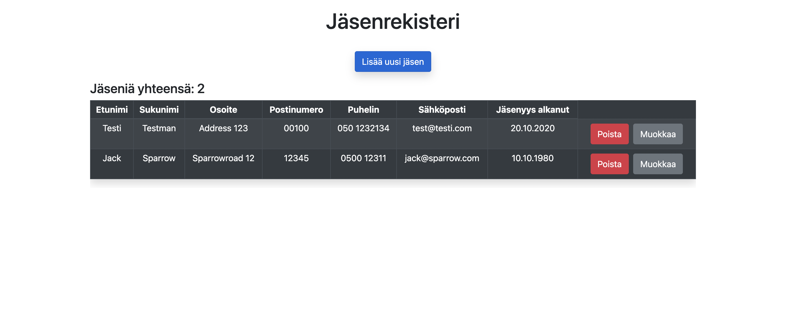
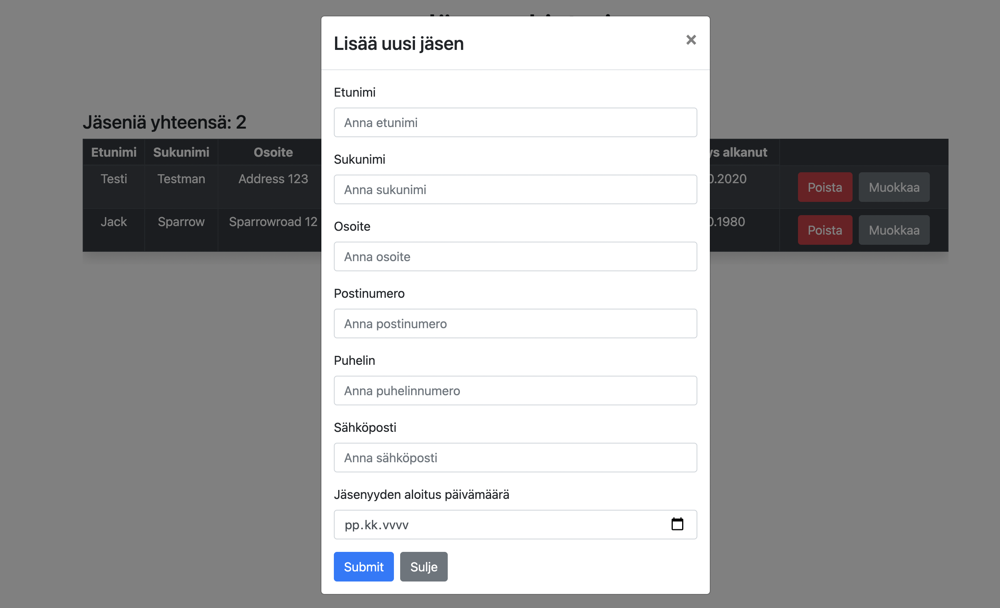
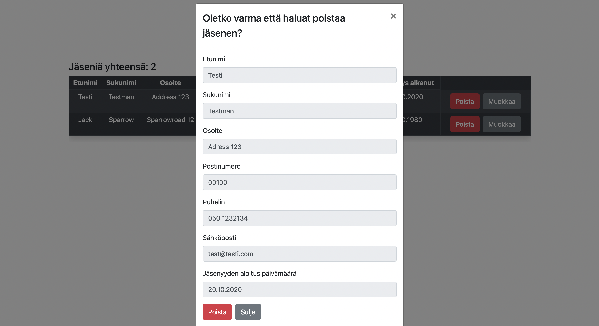

# Membership Register App

### About the project





School NoSQL project.
Assignment was to make simple membership register app that have basic CRUD operations. And all data is stored in MondoDB NoSQL-database.

### Built With

- [React](https://reactjs.org/)
- [MongoDB](https://www.mongodb.com/)
- [Node.js](https://nodejs.dev/)
- [Express](https://expressjs.com/)
- [React Bootstrap](https://react-bootstrap.github.io/)

### Getting Started

Here is example if you wanna run this project locally.

#### Installation

1. Use local MongoDB or get free from [MongoDB](https://www.mongodb.com/) for testing.
2. Clone the repo

```sh
git clone https://github.com/Muugmaster/jasenrekisteri-mern.git
```

3. Install npm packages for backend and frontend

```sh
cd server
npm install
cd ..
cd client
npm install
```

4. Modify `.env_sample` file with your MongoDB connection string and PORT and rename it to `.env`
5. Start backend

```sh
cd server
npm start
```

6. Start frontend

```sh
cd client
npm start
```

7. Go to `http://localhost:3000` and check the app.
